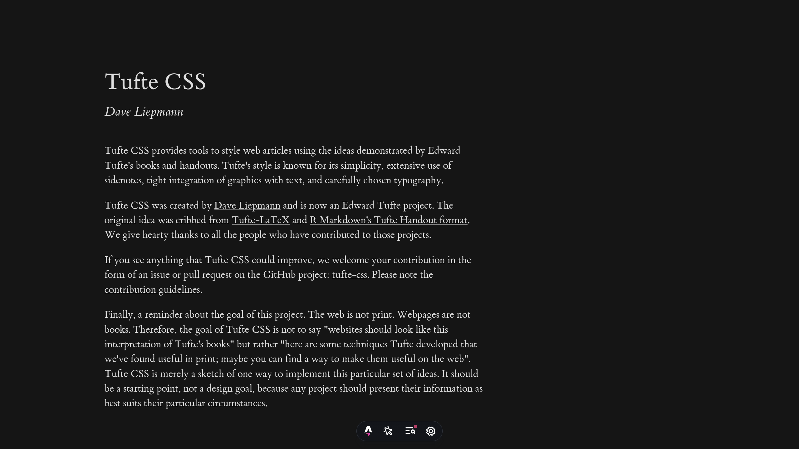
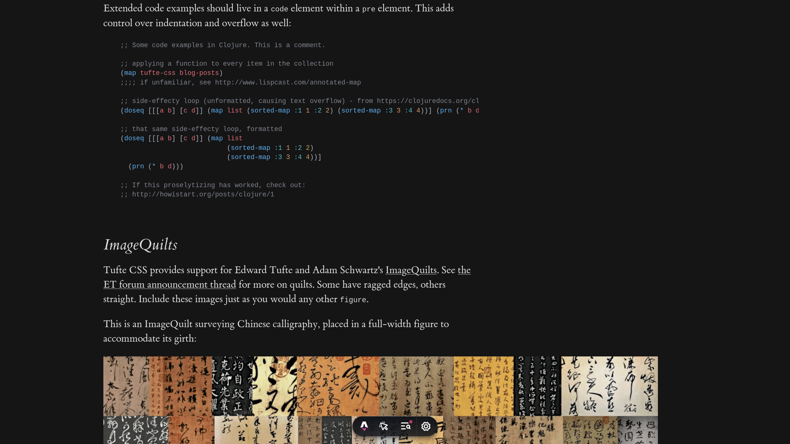

# Minimal Tufte Blog Template

A minimal blog template built on the wonderful
[tufte-css](https://github.com/edwardtufte/tufte-css).

The template is intentionally minimal to reduce the number of moving parts.

We use [Astro](https://astro.build) with
[@astrojs/markdown-satteri](https://github.com/astrojs/markdown-satteri) for
parsing markdown, and [KaTeX](https://katex.org) for LaTeX support.

All assets live in `./public`, including `tufte.css` for styling and the
`et-book` font files. Assets are made to be relatively static to allow for
happier hacking.

The repo includes sample content and a few helper components to speed up
development.

Demo posts can be found in `./src/content/blog/`.

Made with love and without AI.

Markdown render of the tufte-css demo:

